<!-- _class: title -->

# Multisensory Communicative AI

Bagus Tris
Assistant Professor – Human-AI Interaction

---

## Motivation

- Humans use multiple modalities to communicate (e.g., speech, facial expressions, gestures).
- We sense the world through multiple channels — not just five.
- **Multisensory integration**: how humans and machines combine these channels.

---

## Chapter 5 Overview: Sensation, Perception & the Senses

| Section | Topic |
|---------|-------|
| 5.1 | Sensation vs. Perception |
| 5.2 | Waves and Wavelengths |
| 5.3 | Vision |
| 5.4 | Hearing |
| 5.5 | The Other Senses |
| 5.6 | Gestalt Principles of Perception |

---

# 5.1 Sensation vs. Perception

---

## Key Definitions

**Sensation** — occurs when sensory receptors detect stimuli and convert them into neural signals sent to the brain.

**Transduction** — conversion from sensory stimulus energy to action potential.

**Stimuli** (sing. *stimulus*) — any detectable change in the internal or external environment.

**Perception** — the way sensory information is organized, interpreted, and consciously experienced.

> Not all sensations result in perception.

---

## Our Sensory Modalities

More than five senses exist:

| Sense | Modality |
|-------|----------|
| Vision | Light |
| Hearing (audition) | Sound waves |
| Smell (olfaction) | Chemical |
| Taste (gustation) | Chemical |
| Touch (somatosensation) | Mechanical |
| Balance | Vestibular |
| Body position/movement | Proprioception & Kinesthesia |
| Pain | Nociception |
| Temperature | Thermoception |

---

## Absolute Threshold

**Absolute threshold** — minimum stimulus energy detectable 50% of the time.

Examples:
- Candle flame visible from **30 miles** away on a clear night
- Clock tick audible from **20 feet** away in quiet conditions

**Subliminal messages** — stimuli below threshold for conscious awareness. Research shows little effect on real-world behavior.

---

## Difference Threshold & Weber's Law

**Just noticeable difference (JND)** — the smallest detectable difference between two stimuli.

> **Weber's Law**: The difference threshold is a *constant fraction* of the original stimulus.

Example: A phone screen lighting up is obvious in a dark movie theater, but unnoticed in a brightly lit arena — same brightness, different context.

---

## Bottom-Up vs. Top-Down Processing

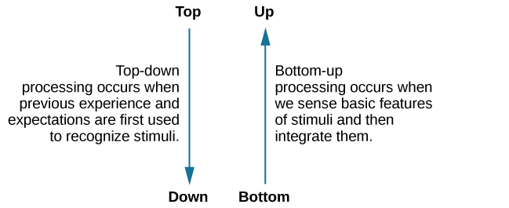

**Figure 5.2** Top-down processing uses prior knowledge; bottom-up processing is driven by sensory input.

---

## Bottom-Up & Top-Down

**Bottom-up**: automatic, stimulus-driven, involuntary
- e.g., crashing sound in a restaurant captures attention regardless of what you were focusing on

**Top-down**: goal-directed, deliberate, voluntary
- e.g., scanning for a yellow key fob in likely locations, ignoring the ceiling fan

> Sensation is **physical**; Perception is **psychological**.

---

## Sensory Adaptation

**Sensory adaptation** — the decrease in sensitivity to a stimulus that remains constant over time.

Example: A flashing construction light outside your hotel window seems very annoying at first, but after watching TV for a while, you no longer notice it — even though your photoreceptors still detect it.

---

## Attention & Inattentional Blindness

**Inattentional blindness** — failure to notice a fully visible stimulus because attention is elsewhere.

Simons & Chabris (1999): While counting basketball passes, nearly **half** of participants failed to notice a gorilla walking through the scene — visible for 9 seconds.

**Signal detection theory** — ability to identify a stimulus embedded in background noise; affected by motivation and expectation.

---

## Inattentional Blindness

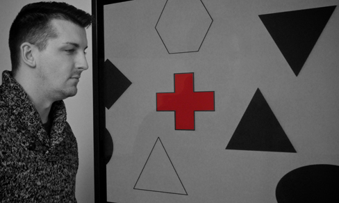

**Figure 5.3** ~⅓ of participants missed a red cross on screen because attention was focused on black/white figures. *(credit: Cory Zanker)*

---

## Cultural & Individual Effects on Perception

- Beliefs, values, personality, and culture all shape perception.
- Segall et al. (1963): Western cultures (carpentered world) more susceptible to the **Müller-Lyer illusion**; Zulu people (round structures) less susceptible.
- Cross-cultural differences also found in odor identification and taste preferences.

---

## Müller-Lyer Illusion

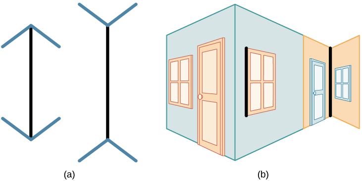

**Figure 5.4** Lines appear to be different lengths although they are identical — a classic example of how top-down expectations shape perception.

---

# 5.2 Waves and Wavelengths

---

## Wave Properties

Two key physical characteristics of a wave:

- **Amplitude** — distance from center line to crest (peak) or trough; associated with **intensity**
- **Wavelength** — length from one peak to the next; inversely related to frequency
- **Frequency** — number of wave cycles per second, measured in **hertz (Hz)**

Higher frequency = shorter wavelength; lower frequency = longer wavelength.

---

## Wave Amplitude and Wavelength

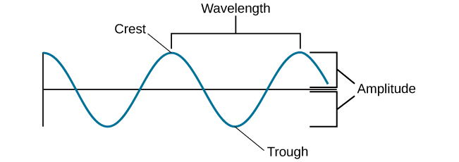

**Figure 5.5** Amplitude is measured from peak to trough; wavelength is measured peak to peak.

---

## Frequency and Wavelength

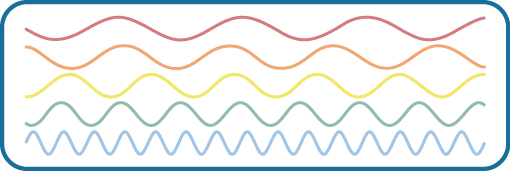

**Figure 5.6** Waves of differing wavelengths and frequencies. From top to bottom: wavelengths decrease, frequencies increase.

---

## Light Waves: The Electromagnetic Spectrum

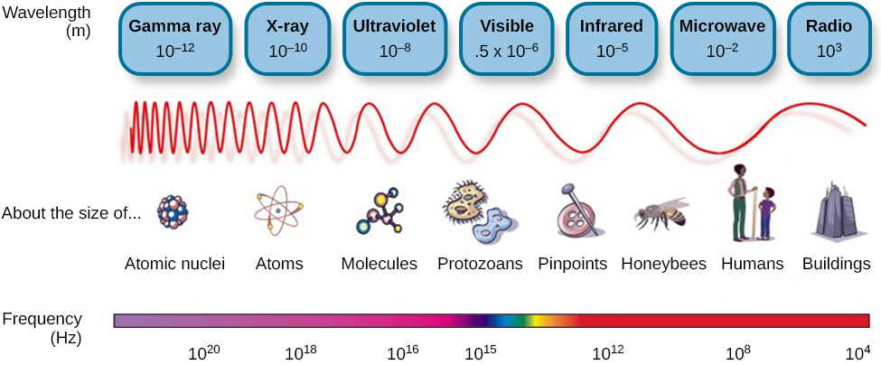

**Figure 5.7** Visible light is only a small portion of the full electromagnetic spectrum (380–740 nm).

Other species detect beyond human range: honeybees (UV), some snakes (infrared).

---

## Color and Wavelength

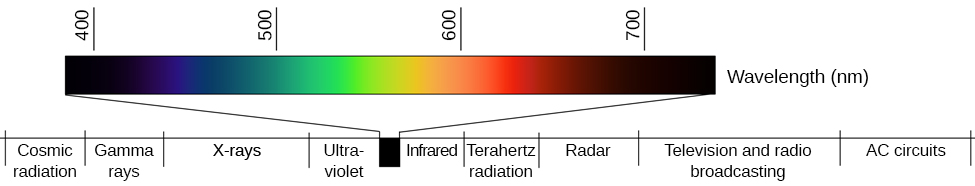

**Figure 5.8** Different wavelengths correspond to different colors. Mnemonic: **ROYGBIV**.
- Reds → longer wavelengths
- Violets/Blues → shorter wavelengths
- Amplitude → brightness/intensity

---

## Sound Waves

- **Pitch** ↔ frequency: high frequency = high pitch; low frequency = low pitch
- Human audible range: **20–20,000 Hz**
- **Loudness** ↔ amplitude, measured in **decibels (dB)**
  - Conversation ≈ 60 dB; Rock concert ≈ 120 dB
  - Hearing damage risk from ~80 dB; pain threshold ~130 dB
- **Timbre** — a sound's purity; explains why instruments sound different at same pitch and loudness

---

## Loudness of Common Sounds

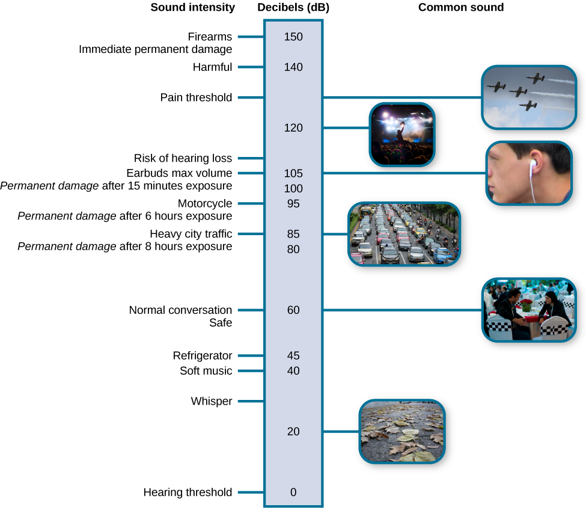

**Figure 5.9** Loudness levels of common sounds. ~⅓ of all hearing loss is due to noise exposure.

---

# 5.3 Vision

---

## Anatomy of the Visual System

**Figure 5.10** Our eyes gather sensory information for interpreting the world.

---

## The Eye

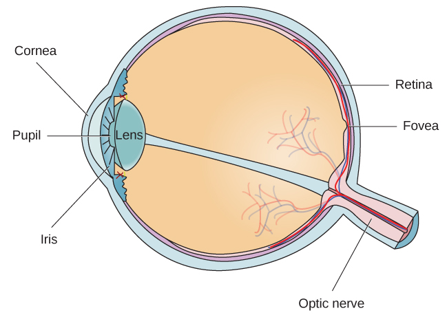

**Figure 5.11** Anatomy of the eye.

**Key structures:** cornea → pupil → lens → retina → fovea → optic nerve

---

## Photoreceptors: Rods and Cones

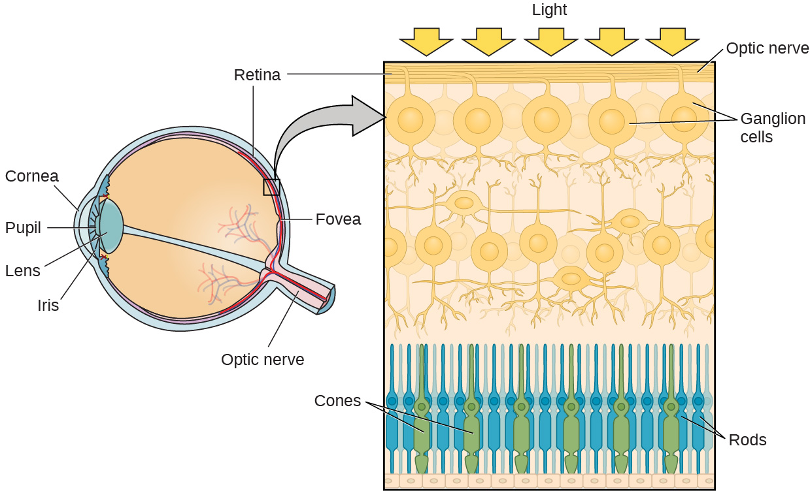

**Figure 5.12** Cones (green) are concentrated in the fovea; rods (blue) cover the rest of the retina.

| | Rods | Cones |
|--|------|-------|
| Location | Periphery | Fovea |
| Light condition | Dim | Bright |
| Function | Motion, low-light | Color, detail |

---

## Visual Pathways in the Brain

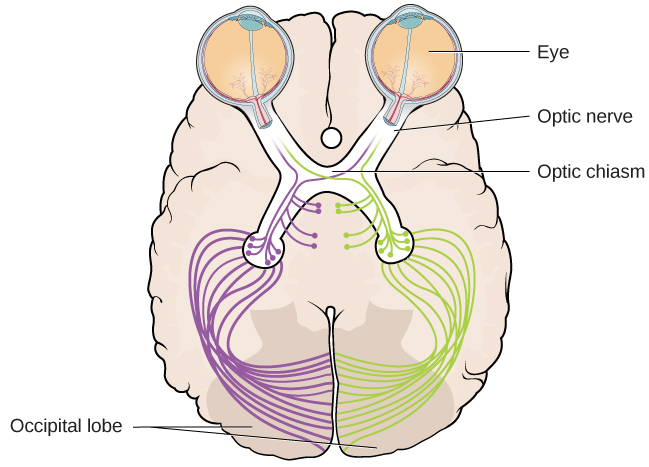

**Figure 5.13** At the optic chiasm, right-visual-field info goes to left hemisphere and vice versa. Processed in occipital lobe.

- **"What" pathway** — object recognition
- **"Where/How" pathway** — location and spatial interaction

---

## Color Vision

**Trichromatic theory**: three cone types sensitive to red, green, and blue; all colors produced by combining these.

**Opponent-process theory**: color coded in opponent pairs (red-green, blue-yellow, black-white). Explains **negative afterimages**.

Both theories apply — trichromatic at the retina level; opponent-process further up toward the brain.

---

## Trichromatic Theory

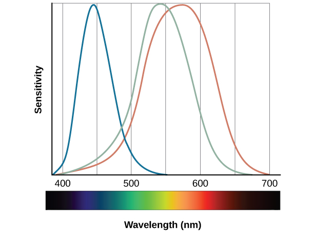

**Figure 5.14** Sensitivity curves for the three cone types. Red-green color blindness affects ~8% of European males.

---

## Negative Afterimage

**Figure 5.16** Stare at the white dot for 30–60 seconds, then look at a white surface. The afterimage demonstrates opponent-process theory.

---

## Depth Perception

**Binocular cues** (both eyes):
- **Binocular disparity** — slightly different view from each eye; basis of 3-D movies

**Monocular cues** (one eye):
- **Linear perspective** — parallel lines converge in the distance
- **Interposition** — partial overlap of objects
- Relative size, closeness to horizon

---

## Linear Perspective (Monocular Depth Cue)

**Figure 5.17** We perceive depth in a 2-D image through monocular cues like converging parallel lines. *(credit: Marc Dalmulder)*

---

# 5.4 Hearing

---

## Anatomy of the Auditory System

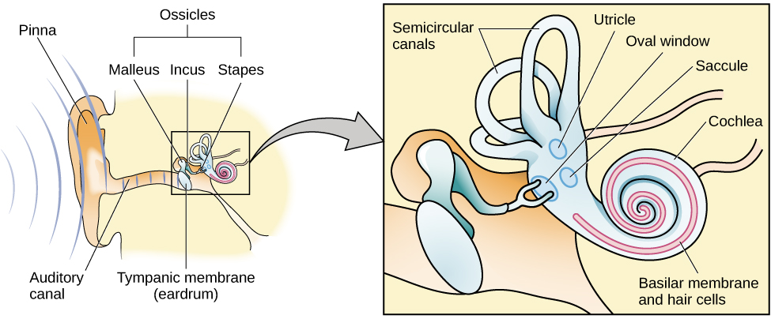

**Figure 5.18** The ear: outer (pinna, tympanic membrane), middle (ossicles: malleus, incus, stapes), inner (cochlea, basilar membrane).

---

## How We Hear

Sound waves → tympanic membrane → ossicles → oval window → cochlear fluid → **hair cells** → auditory nerve → brain (auditory cortex in temporal lobe)

**Hair cells** are the auditory receptor cells. Their mechanical activation generates neural impulses.

---

## Pitch Perception

Two theories:

**Temporal theory** — frequency coded by firing rate of hair cells. Limited to ~4,000 Hz.

**Place theory** — different parts of basilar membrane respond to different frequencies. Base = high frequency; tip = low frequency.

Both apply: up to ~4,000 Hz, both rate and place contribute. Higher frequencies rely on place alone.

---

## Sound Localization

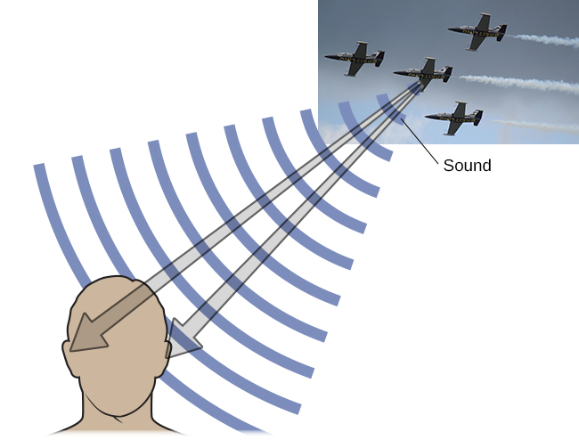

**Figure 5.19** Sound localization uses both monaural and binaural cues.

- **Monaural cues**: pinna shape → above/below and front/behind
- **Interaural level difference**: louder in nearer ear
- **Interaural timing difference**: tiny delay between ears → left/right location

---

## Hearing Loss

**Conductive hearing loss** — failure in vibration of eardrum/ossicles; treatable with hearing aids.

**Sensorineural hearing loss** — failure in neural transmission from cochlea to brain; most common form.

Causes: aging, noise exposure, trauma, infections, medications.

**Cochlear implants** — bypass hair cells and directly stimulate the auditory nerve.

---

## Noise-Induced Hearing Loss

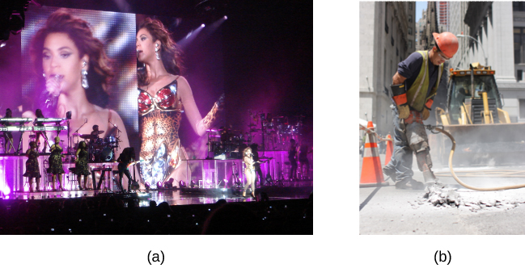

**Figure 5.20** Environments with sustained loud noise (music, construction) are major risk factors for sensorineural hearing loss.

---

# 5.5 The Other Senses

---

## Chemical Senses: Taste (Gustation)

At least **6 taste qualities**: sweet, salty, sour, bitter, **umami**, and fatty.

- Taste buds on the tongue detect molecules dissolved in saliva.
- Taste information → medulla → thalamus → limbic system → **gustatory cortex** (frontal-temporal junction)
- Taste buds regenerate every 10–14 days.

---

## Taste Bud Anatomy

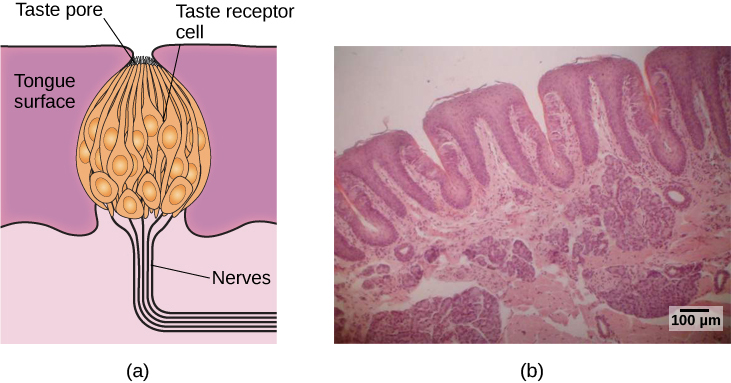

**Figure 5.21** (a) Taste receptor cells in a taste bud. (b) Microscopic view of tongue surface.

---

## Chemical Senses: Smell (Olfaction)

- Olfactory receptors in the nasal mucous membrane detect airborne molecules.
- Signals go to the **olfactory bulb** → limbic system and **primary olfactory cortex**.
- Dogs have 800–1,200 functional olfactory receptor genes vs. ~400 in humans.
- **Pheromones** — chemical signals between individuals (prominent in many species).
- Taste and smell work **together** to produce flavor perception.

---

## Olfactory Receptors

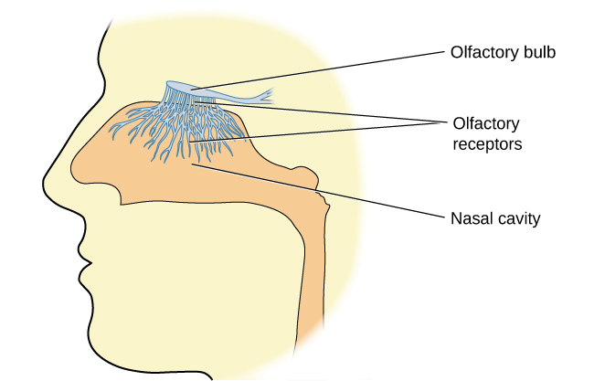

**Figure 5.22** Hair-like olfactory receptor extensions protrude into the nasal mucous membrane to bind odor molecules.

---

## Touch: Somatosensation

Four main types of skin receptors:

| Receptor | Responds to |
|----------|-------------|
| Meissner's corpuscles | Pressure, low-frequency vibration |
| Pacinian corpuscles | Transient pressure, high-frequency vibration |
| Merkel's disks | Light pressure |
| Ruffini corpuscles | Stretch |

Free nerve endings also detect **temperature (thermoception)** and **pain (nociception)**.

---

## Skin Receptors

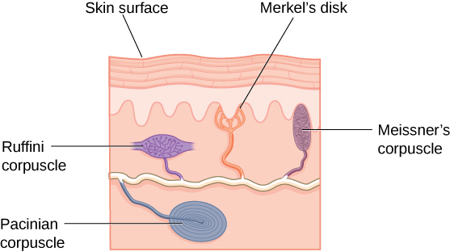

**Figure 5.23** Multiple receptor types in the skin respond to different touch stimuli. Signals travel via spinal cord to **somatosensory cortex** (postcentral gyrus).

---

## Pain (Nociception)

Pain is adaptive — signals injury and motivates avoidance.

- **Inflammatory pain** — signals tissue damage
- **Neuropathic pain** — amplified signals from damaged neurons

**Congenital insensitivity to pain (congenital analgesia)** — extremely rare; individuals sustain severe unnoticed injuries and have shorter life expectancies.

---

## Vestibular, Proprioceptive & Kinesthetic Senses

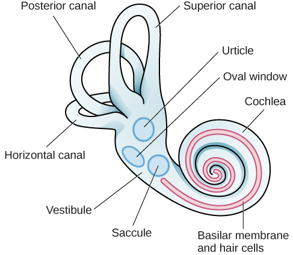

**Figure 5.24** Vestibular organs (utricle, saccule, semicircular canals) next to the cochlea in the inner ear.

- **Vestibular sense** — balance and head/body orientation
- **Proprioception** — perception of body position
- **Kinesthesia** — perception of body movement through space

---

# 5.6 Gestalt Principles of Perception

---

## Gestalt Psychology

Founded by **Max Wertheimer** (early 20th c.), with Köhler and Koffka.

> "The whole is different from the sum of its parts."

The brain organizes sensory input into meaningful perceptions in **predictable ways** — these are the Gestalt principles.

Key idea: perception is an active construction, not a passive recording.

---

## Figure-Ground Relationship

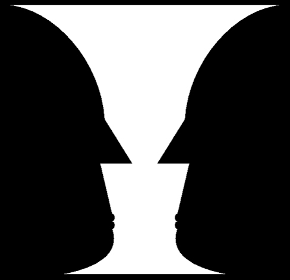

**Figure 5.25** The Rubin vase: perception alternates between a vase (white figure) and two faces (black figure), depending on what is perceived as figure vs. ground.

---

## Proximity

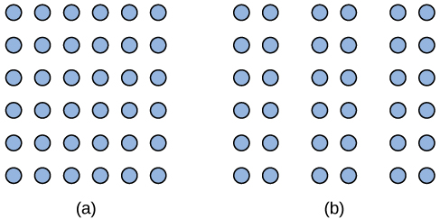

**Figure 5.26** **Proximity**: things close to each other tend to be grouped together. Left: one block; right: three columns.

---

## Similarity

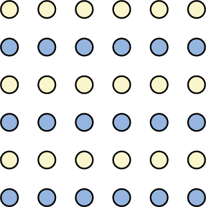

**Figure 5.27** **Similarity**: like elements are grouped together. We perceive alternating colored rows rather than a grid.

---

## Good Continuation & Closure

**Figure 5.28** **Good continuation**: we perceive two overlapping lines, not four separate line segments.

**Figure 5.29** **Closure**: we perceive complete shapes (circle, rectangle) even when parts are missing.

---

## Perceptual Set & Bias

**Perceptual hypotheses** — educated guesses when interpreting sensory information, shaped by:
- Personality and prior experience
- Expectations and verbal priming
- Cultural background and implicit biases

Research shows implicit racial bias can affect perception of objects (e.g., misidentifying non-weapons as weapons when paired with racialized images).

---

## Principles of Multisensory Integration

- **Temporal principle**: stimuli from different modalities are more likely integrated if they occur at the same time.
- **Spatial principle**: stimuli are more likely integrated if they occur at the same location.
- **Inverse effectiveness principle**: integration is stronger when individual unisensory signals are weak.

---

## Multisensory Illusions

- **McGurk effect**: mismatched audio and visual speech cues produce a third, different percept.
- **Ventriloquist effect**: sound source perceived at the visual location (puppet's mouth) rather than the actual acoustic source.
- **Rubber hand illusion**: synchronous touch of a fake and real hand induces sense of ownership of the fake hand.

---

## Summary

| Chapter | Key Concept |
|---------|-------------|
| 5.1 | Sensation ≠ Perception; attention, adaptation, signal detection |
| 5.2 | Waves: amplitude → intensity; frequency → pitch/color |
| 5.3 | Vision: rods/cones, color theories, depth cues |
| 5.4 | Hearing: hair cells, pitch theories, sound localization |
| 5.5 | Other senses: taste, smell, touch, pain, balance |
| 5.6 | Gestalt: figure-ground, proximity, similarity, closure |

---

## Sources

OpenStax Psychology 2e, Chapter 5 (Spielman, Jenkins & Lovett, 2020).
Licensed under [CC BY 4.0](https://creativecommons.org/licenses/by/4.0/).
Access free at openstax.org
